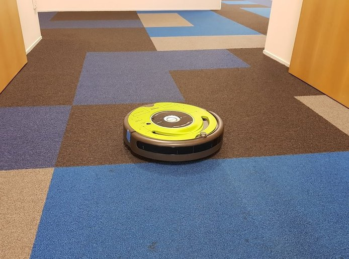
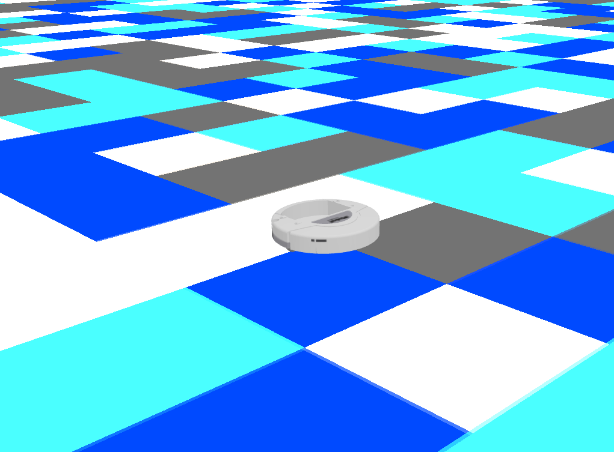

# Carpet Localisation ROS

A ROS package for running [carpet localisation](https://github.com/tim-fan/carpet_localisation) on a ROS enabled robot.

Includes gazebo simulation of a representative carpet world for testing.



**Figure**: Roomba in target localisation enviroment. Localisation is achieved with reference to a map of the carpet color pattern throughout the office.

## Build

Build process is tested on ROS Noetic / Ubuntu Focal.

[create_robot](https://github.com/AutonomyLab/create_robot) is also built from source, as the gazebo simulation uses [create_description](https://github.com/AutonomyLab/create_robot/tree/melodic/create_description), and this is not currently released in Noetic.
```bash
# apt deps:
sudo apt install python3-vcstool python3-catkin-tools

# clone sources:
mkdir -p catkin_ws/src && cd catkin_ws/src
curl https://raw.githubusercontent.com/tim-fan/carpet_localisation_ros/main/workspace.repos | vcs import

# install rosdeps:
rosdep install --from-paths carpet_localisation/ create_robot/create_description/ --ignore-src --rosdistro noetic

# disable buiding packages which fail on noetic:
touch create_robot/create_bringup/CATKIN_IGNORE
touch create_robot/create_driver/CATKIN_IGNORE

# build:
cd ..
catkin config --extend /opt/ros/noetic/
catkin build
```

## Usage

### Simulation:

To launch the simulated carpet world:
```bash
source devel/setup.bash
roslaunch carpet_localisation carpet_simulation.launch
```

You should see a gazebo world like the following:



If you have an xbox-style controller connected, you will be able to drive the simulated carpet robot around the environment.

### TODO
* Finish the actual integration with [carpet localisation](https://github.com/tim-fan/carpet_localisation) and document/demo.